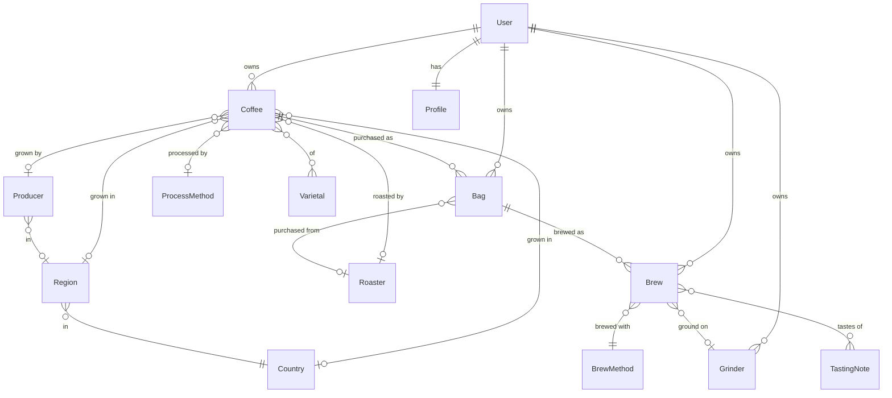

# coffee-nut Architecture

A web application for coffee enthusiasts to record the beans they buy and the
brews they make with them, and to share individual brews publicly by link.

Status: **proposed**. No application code has been written. This document and
`docs/selection-report.md` are the deliverable for review before scaffolding.

## 1. Decisions

Settled with the project owner before writing this document:

| Decision | Choice | Consequence |
| --- | --- | --- |
| API layer | Django REST Framework | Conventional, well-documented, strong permission and serializer primitives. OpenAPI via drf-spectacular. |
| Authentication | JWT access + refresh (simplejwt) | One auth model for web and native clients. Web stores the refresh token in an `HttpOnly` cookie; native clients hold it in the platform keystore. See §5. |
| Frontend | SvelteKit in SPA mode | `adapter-static`, `ssr = false`, HTML fallback. File-based routing and per-route code splitting with no server runtime to deploy. |
| Product identity | `Coffee` + `Bag` split | `Coffee` is the product (origin, process, roaster). `Bag` is one purchase of it. Brews attach to a `Bag`. |
| Reference data | Seeded canonical + user custom | We ship curated fixtures; users may add private entries. A provider interface is defined but not implemented. |
| Sharing | Public links now, social-ready model | v1 exposes only unguessable per-brew links, but ownership flows through one visibility chokepoint so follows or grants can be added later without reworking every queryset. |
| Devkit | Prune to what we use | See `docs/selection-report.md`. |

## 2. System Shape

```
   SvelteKit SPA            native iOS / Android (later)
   (static bundle)                     |
          |                            |
          +------------ HTTPS ---------+
                        |
                  Django + DRF
                   /api/v1/...
                        |
              +---------+---------+
              |                   |
          Postgres 17          Redis 7
        (system of record)   (cache, throttles)
```

Locally, per `DECISIONS.md`, Postgres and Redis run in Docker Compose while
Django and Vite run on the host. `scripts/worktree-ports.sh` already assigns
non-colliding ports per worktree; this worktree resolves to API `9620`, web
`9630`, Postgres `9640`, Redis `9650`.

The SPA is a static bundle. It is not privileged over the future native
clients: every capability the web app has is a documented REST endpoint. That
constraint is the whole point of §4's conventions.

## 3. Repository Layout

```
pyproject.toml            uv workspace root (Ruff, MyPy, pytest config)
.python-version           interpreter pin
uv.lock                   committed
package.json              bun workspace root -> apps/web
compose.yml               Postgres + Redis
scripts/                  dev, lint, typecheck, test, format, check-all

apps/api/
  manage.py
  pyproject.toml
  src/coffeenut/
    settings/             base.py, local.py, production.py, test.py
    urls.py  asgi.py  wsgi.py
    common/               abstract models, managers, permissions, pagination,
                          error handler, units
    accounts/             User, Profile, auth + registration endpoints
    catalog/              reference data: countries, regions, producers,
                          roasters, varietals, processes, brew methods,
                          tasting notes, grinders
    coffee/               Coffee, Bag
    brewing/              Brew
    sharing/              public read-only views
  tests/

apps/web/
  svelte.config.js  vite.config.ts
  src/
    routes/               file-based routes, incl. /s/[token] public page
    lib/api/              generated types + fetch wrapper
    lib/stores/           auth, preferences
    lib/components/
```

Django apps are split by domain rather than by layer. `common` holds the
abstract bases every domain app inherits; it must not import from the domain
apps.

## 4. Data Model

### 4.1 Ownership and visibility

Every user-owned row inherits one abstract base. This is the single most
important structural decision in the schema, because it is what makes the
"social later" option cheap.

```python
class Visibility(models.TextChoices):
    PRIVATE  = "private"    # owner only (default)
    UNLISTED = "unlisted"   # anyone holding share_token
    PUBLIC   = "public"     # reserved; not exposed in v1

class OwnedModel(models.Model):
    id           = UUIDField(primary_key=True, default=uuid4, editable=False)
    owner        = ForeignKey(User, on_delete=CASCADE, related_name="+")
    visibility   = CharField(choices=Visibility, default=Visibility.PRIVATE)
    share_token  = UUIDField(null=True, blank=True, unique=True, db_index=True)
    created_at   = DateTimeField(auto_now_add=True)
    updated_at   = DateTimeField(auto_now=True, db_index=True)

    objects = OwnedQuerySet.as_manager()

    class Meta:
        abstract = True
```

`OwnedQuerySet.visible_to(user)` is the **only** sanctioned way a view reaches
user data. Today it returns `owner=user`. When social features arrive, that one
method grows a `Share` join and every endpoint inherits it. Nothing else in the
codebase should filter on `owner` directly.

`share_token` lives on the base, so promoting bags or coffees to shareable
later requires no migration. v1 only issues tokens for brews.

### 4.2 Accounts

A custom user model from day one — retrofitting one later is the single worst
migration in Django.

**`User`** (`AbstractBaseUser` + `PermissionsMixin`) — UUID pk, `email` as
`USERNAME_FIELD` (unique, citext or lowercased on save), `display_name`,
`is_active`, `is_staff`, `date_joined`, `email_verified_at`.

**`Profile`** — one-to-one with `User`. `preferred_units` (`metric` |
`imperial`), `default_brew_method` (FK, nullable), `timezone`, `avatar`
(deferred until object storage exists), `bio`.

### 4.3 Reference data (`catalog`)

Canonical and user-custom entries share one table, distinguished by a nullable
owner. `owner IS NULL` means canonical, curated by us.

```python
class ReferenceModel(models.Model):
    id          = UUIDField(primary_key=True, default=uuid4)
    name        = CharField(max_length=200)
    slug        = SlugField(max_length=220)
    owner       = ForeignKey(User, null=True, blank=True, on_delete=CASCADE)
    source      = CharField(default="manual")   # manual | seed | <provider>
    external_id = CharField(null=True, blank=True)
    synced_at   = DateTimeField(null=True, blank=True)
    merged_into = ForeignKey("self", null=True, blank=True, on_delete=SET_NULL)
    created_at, updated_at

    class Meta:
        abstract = True
        constraints = [
            UniqueConstraint(fields=["slug"], condition=Q(owner__isnull=True),
                             name="%(class)s_unique_canonical_slug"),
            UniqueConstraint(fields=["owner", "slug"],
                             condition=Q(owner__isnull=False),
                             name="%(class)s_unique_owned_slug"),
        ]
```

Two details are doing real work here:

- **`source` / `external_id` / `synced_at` exist now, unused.** They are what
  let an external roaster or farm API be added later without a schema change to
  every reference table.
- **`merged_into`** is the promotion path. When many users type "Onyx Coffee
  Lab", we create the canonical row and point the custom rows at it, without
  breaking anyone's existing `Coffee` foreign keys.

| Model | Fields beyond the base | Seeded? |
| --- | --- | --- |
| `Country` | `iso_alpha2`, `iso_alpha3` | Yes — full ISO 3166-1. Canonical only. |
| `Region` | `country` FK, `altitude_min_masl`, `altitude_max_masl` | Yes — major growing regions (Yirgacheffe, Huila, Antigua, …). Custom allowed. |
| `Producer` | `country` FK, `region` FK, `altitude_*`, `website` | Starter set only. This is the "farm" of the brief. |
| `Roaster` | `country` FK, `city`, `website` | Starter set. The "local cafe" case is a user-custom row. |
| `Varietal` | `parent` FK (self) | Yes — Bourbon, Typica, Geisha, SL28, Caturra, … |
| `ProcessMethod` | `category` (washed / natural / honey / other) | Yes — washed, natural, honey, anaerobic, wet-hulled, … |
| `BrewMethod` | `parameter_schema` (JSON) | Yes — pour over, espresso, moka pot, french press, aeropress, cold brew, drip, siphon. |
| `TastingNote` | `parent` FK (self), `color` | Yes — a modest, independently worded hierarchy. Deliberately *not* the SCA/WCR Flavor Wheel; see §10.2. |
| `Grinder` | `burr_type`, `setting_min`, `setting_max`, `step_size` | No — user equipment, always owned. |

`BrewMethod.parameter_schema` deserves explanation. It does **not** store brew
data. It declares which of `Brew`'s columns are relevant, required, or hidden
for that method, plus sane ranges. The form UI and the serializer's
method-aware validation both read it. Espresso surfaces `pressure_bar` and
`yield_grams`; pour over surfaces `bloom_water_grams`. Adding a brew method is a
fixture change, not a migration.

### 4.4 Coffee and Bag

**`Coffee`** (`OwnedModel`) — the product identity. Buying the same lot twice
reuses one `Coffee`.

`name`, `roaster` FK, `country` FK, `region` FK, `producer` FK, `varietals`
M2M, `process` FK, `harvest_year` (small int), `roast_level` (light →
medium-light → medium → medium-dark → dark), `altitude_min_masl`,
`altitude_max_masl`, `is_decaf`, `notes`. All reference FKs nullable — a user
who knows only "Ethiopian, washed" must still be able to save.

**`Bag`** (`OwnedModel`) — one purchase.

`coffee` FK (required, `CASCADE`), `purchased_from` FK → `Roaster` (nullable;
the cafe you bought it from, which is often *not* the roaster),
`purchase_date`, `roast_date`, `opened_date`, `weight_grams`, `price_amount` +
`price_currency` (ISO 4217), `is_finished`, `finished_date`, `notes`.

Splitting `roast_date` onto `Bag` rather than `Coffee` is deliberate: freshness
is a property of the physical bag, and it is the field most likely to differ
between two purchases of the same coffee. Remaining weight is derived from the
attached brews' doses at read time, not stored.

### 4.5 Brew

**`Brew`** (`OwnedModel`) — one attempt, attached to one `Bag`.

| Group | Fields |
| --- | --- |
| Identity | `bag` FK (required, `CASCADE`), `method` FK → `BrewMethod`, `brewed_at` (defaults to now, editable) |
| Dose | `dose_grams`, `water_grams`, `water_temp_c` |
| Grind | `grinder` FK (nullable), `grind_setting` (free text), `grind_microns` (nullable) |
| Time | `total_time_seconds`, `bloom_time_seconds`, `bloom_water_grams` |
| Espresso | `pressure_bar`, `yield_grams` |
| Verdict | `liked` (nullable bool), `tasting_notes` M2M, `notes` (text) |
| Taste profile | `acidity`, `sweetness`, `body`, `bitterness`, `aftertaste` — nullable 1–5 |
| Escape hatch | `extras` (JSON, validated against `method.parameter_schema`) |

`liked` is nullable on purpose: `null` is unrated, `true` is thumbs up, `false`
is thumbs down. That distinction matters for "show me my good brews" and cannot
be expressed by a non-null boolean.

Brew ratio is computed (`water_grams / dose_grams`), never stored.

**Why real columns instead of one JSON blob.** Method-specific parameters are
tempting to model as `parameters = JSONField()`. We are not doing that, because
three separate clients consume this API and a JSON blob is invisible to
OpenAPI, unvalidatable at the DB layer, and painful to filter or aggregate on.
Almost every field above applies to two or more methods, so the wide-nullable
table is not as wide as it first appears. `extras` remains for genuinely
experimental parameters, and `parameter_schema` keeps the UI method-aware
without sacrificing a typed contract.

### 4.6 Entity relationships



### 4.7 Database-level guards

The brief asks specifically for database guards, so several invariants live in
Postgres rather than only in Python:

- `CHECK` constraints: `dose_grams > 0`, `water_grams > 0`,
  `water_temp_c BETWEEN 0 AND 100`, taste axes `BETWEEN 1 AND 5`,
  `harvest_year BETWEEN 1900 AND 2100`.
- `UniqueConstraint` on `share_token` (nullable, unique) and on the canonical
  and owned reference slugs shown in §4.3.
- Foreign keys with explicit `on_delete` everywhere; no `SET_NULL` on a
  required relationship.
- Composite indexes matching the real access paths: `(owner, -created_at)` on
  each owned table, `(bag, -brewed_at)` on `Brew`, `(owner, is_finished)` on
  `Bag`.

Postgres row-level security was considered and rejected for v1. Django uses a
single database role, so RLS would require per-request `SET LOCAL` session
variables and would fight the ORM. The queryset chokepoint in §6 is the
practical boundary; RLS stays available if a future audit demands a hard one.

## 5. API Surface

Base path `/api/v1/`. Schema at `/api/schema/` (OpenAPI 3.1, drf-spectacular),
browsable docs at `/api/docs/`.

### 5.1 Cross-cutting conventions

These exist because three clients consume this API, not one. Each is cheap now
and expensive to retrofit.

- **UUID primary keys, client-generatable.** `POST` accepts a client-supplied
  `id`. A mobile client can create a brew offline and sync it later without an
  id-reconciliation pass. Also removes enumeration risk on shared URLs.
- **`?updated_since=<iso8601>` on every list endpoint.** Combined with
  `updated_at` indexes, this is the minimum needed for a future offline sync.
  Adding it later means backfilling indexes on a live table.
- **Cursor pagination** (`?cursor=`, `?page_size=`), ordered by `-created_at`
  or `-brewed_at`. Stable under concurrent inserts, unlike offset paging, which
  matters for infinite scroll on mobile.
- **Canonical SI units at the boundary.** Grams, °C, ml. Imperial display is a
  client concern driven by `Profile.preferred_units`. The API never returns a
  value whose unit depends on who is asking.
- **UTC ISO 8601 timestamps**, `USE_TZ = True`, tz-aware storage throughout.
- **Structured errors** via a custom DRF exception handler, so native clients
  can branch on a code rather than parse English:

  ```json
  {
    "type": "validation_error",
    "detail": "Invalid input.",
    "errors": [
      {"field": "dose_grams", "code": "min_value", "message": "Must be greater than 0."}
    ]
  }
  ```

- **`?expand=`** for nested reads. `GET /brews/?expand=bag.coffee.roaster`
  returns nested objects instead of ids, so a mobile list view is one request
  instead of N. Default responses return ids only.

### 5.2 Authentication

| Method | Path | Purpose |
| --- | --- | --- |
| POST | `/auth/register/` | Create account. Email + password + display name. |
| POST | `/auth/token/` | Obtain access + refresh. |
| POST | `/auth/token/refresh/` | Rotate. Old refresh is blacklisted. |
| POST | `/auth/logout/` | Blacklist the presented refresh token. |
| POST | `/auth/password/change/` | Authenticated change. |
| POST | `/auth/password/reset/` | Request reset email. |
| POST | `/auth/password/reset/confirm/` | Complete reset. |
| POST | `/auth/email/verify/` | Confirm address from emailed token. |
| GET PATCH | `/auth/me/` | Current user + profile. |

### 5.3 Resources

All owner-scoped. All support `updated_since`, cursor pagination, and `expand`.

| Path | Methods | Notable filters |
| --- | --- | --- |
| `/coffees/` | list create retrieve update destroy | `roaster`, `country`, `process`, `varietal`, `is_decaf`, `search` |
| `/bags/` | list create retrieve update destroy | `coffee`, `is_finished`, `purchased_from`, `purchase_date` range |
| `/bags/{id}/brews/` | list | convenience nesting of `/brews/?bag=` |
| `/brews/` | list create retrieve update destroy | `bag`, `method`, `liked`, `brewed_at` range, `tasting_notes` |
| `/brews/{id}/share/` | POST DELETE | issue or rotate / revoke a share token |
| `/grinders/` | list create retrieve update destroy | — |
| `/me/stats/` | list | aggregate counts for the dashboard |

Reference endpoints — `GET` returns canonical entries plus the caller's own
custom ones; `POST` creates a custom one owned by the caller. Canonical rows are
read-only to everyone.

`/countries/`, `/regions/`, `/producers/`, `/roasters/`, `/varietals/`,
`/processes/`, `/brew-methods/`, `/tasting-notes/`

Each supports `?q=` typeahead, ranking canonical entries above custom ones and
prefix matches above substring matches. This endpoint shape is what makes the
brief's autofill requirement work: one control, one request, both data sources.

### 5.4 Public sharing

| Method | Path | Auth |
| --- | --- | --- |
| GET | `/public/brews/{share_token}/` | None |

Toggling the brief's "publicly shareable" checkbox calls
`POST /brews/{id}/share/`, which sets `visibility = unlisted`, generates a
`share_token`, and returns the full URL. `DELETE` clears both — a revoked link
dies immediately.

Three rules on the public view, all of them load-bearing:

1. **A separate `PublicBrewSerializer`.** Not the authenticated serializer with
   fields excluded. Someone will add a field to the private serializer someday;
   an explicit allowlist means that field cannot leak by default. Price and
   purchase source are excluded; the owner is reduced to `display_name`.
2. **404, never 403,** on an unknown, revoked, or private token. A 403
   confirms a token once existed.
3. **Throttled and `X-Robots-Tag: noindex`.** Unlisted means unlisted; an
   unguessable URL should not arrive in a search index.

The SPA serves this at `/s/{token}` with no auth guard and no token refresh
attempt.

## 6. Permissions and Tenancy

Layered deliberately, because the brief calls out cross-user access as a
requirement rather than an assumption.

1. **Queryset scoping.** Every viewset's `get_queryset()` returns
   `Model.objects.visible_to(self.request.user)`. A row the caller cannot see
   does not exist, so unauthorized access yields 404 rather than 403.
2. **Object permission.** An `IsOwner` class runs as a backstop. It should be
   unreachable if layer 1 is correct — that is the point.
3. **Server-assigned ownership.** `owner` is read-only on every serializer and
   set in `perform_create` from `request.user`. A client-supplied `owner` is
   ignored, not rejected, so it cannot be probed.
4. **Cross-object validation.** This is the layer most often missed. Creating a
   `Brew` with `bag=<someone else's id>` must fail. Every FK to a user-owned
   model is validated against `visible_to(request.user)` in the serializer, not
   just for existence. A shared `OwnedPrimaryKeyRelatedField` enforces it so
   individual serializers cannot forget.
5. **Database constraints.** §4.7.

**Tenancy regression test.** A single parametrized test walks the DRF router
registry and, for every registered viewset, asserts that user B receives 404 on
user A's object for retrieve, update, and destroy. Because it reads the router
rather than a hand-maintained list, a new endpoint added without owner scoping
fails CI automatically. This is the highest-leverage test in the suite.

### JWT handling

`SIMPLE_JWT` with rotation and blacklisting on: access 15 minutes, refresh 7
days, `ROTATE_REFRESH_TOKENS = True`, `BLACKLIST_AFTER_ROTATION = True`.

Token storage differs by client, which is the honest answer rather than a
uniform-but-weak one:

- **Web.** The access token lives in a JavaScript variable only — never
  `localStorage`, which is readable by any XSS. The refresh token is set by the
  server as `HttpOnly; Secure; SameSite=Lax`, so script cannot read it. The
  refresh endpoint reads the cookie when present and the request body
  otherwise.
- **Native.** Both tokens go in the platform keystore (Keychain /
  EncryptedSharedPreferences) and travel in the request body as usual.

The SPA's fetch wrapper retries once on 401 behind a single-flight lock, so ten
concurrent requests trigger one refresh rather than ten rotations.

Throttling via DRF `ScopedRateThrottle` backed by Redis: tight scopes on
`/auth/token/`, `/auth/register/`, and password reset; a separate scope on the
public share endpoint keyed by IP.

## 7. Frontend

SvelteKit with `adapter-static`, `export const ssr = false` and
`export const prerender = false` in the root layout, and an `index.html`
fallback. The output is a static bundle; there is no Node server in production.
Svelte 5 runes for state.

### Routes

| Route | Auth | Purpose |
| --- | --- | --- |
| `/login`, `/register` | anonymous | Credential entry. |
| `/` | required | Dashboard: recent brews, open bags. |
| `/coffees`, `/coffees/[id]` | required | Coffee list and detail. |
| `/bags`, `/bags/[id]` | required | Bag list; detail shows this bag's brews with method and verdict — the brief's "recommend a bag" flow. |
| `/bags/[id]/brews/new` | required | Method-aware brew form. |
| `/brews/[id]` | required | Brew detail, edit, share toggle. |
| `/settings` | required | Profile, units, equipment. |
| `/s/[token]` | **anonymous** | Public brew view. No auth guard, no refresh attempt. |

`/s/[token]` sits outside the authenticated layout group so it cannot inherit a
guard by accident.

### API client

Types generated from the OpenAPI schema with `openapi-typescript`, plus a
hand-written fetch wrapper (roughly 100 lines) holding the access token, the
single-flight refresh lock, and error normalisation. Deliberately not a
generated runtime client or a data-fetching library: the brief asks for a small
bundle, and route-level code splitting plus a thin client is how that is
achieved.

`bun run generate:api` regenerates types from a running API; CI fails if the
committed types drift from the schema.

### Bundle discipline

No component framework. Route-level splitting is automatic in SvelteKit. The
method-aware brew form is one component driven by `BrewMethod.parameter_schema`
rather than eight per-method components.

`docs/frontend.md` maps the devkit's neutral `WEB_API_BASE_URL` to SvelteKit's
`PUBLIC_API_BASE_URL`; `scripts/dev.sh` exports the mapping so the worktree
port assignment flows through automatically.

## 8. Testing

| Layer | Tool | Covers |
| --- | --- | --- |
| API unit | pytest + pytest-django | Model constraints, serializer validation, unit conversion. |
| API contract | pytest + DRF `APIClient` | Every endpoint's happy path and auth failure modes. |
| Tenancy | one parametrized router walk | Cross-user 404 on every registered viewset (§6). |
| Migrations | `makemigrations --check` in CI | Model edits without migrations. |
| Web unit | Vitest | Fetch wrapper, refresh lock, unit conversion, stores. |
| Web component | Vitest + Testing Library | Method-aware brew form. |
| E2E | deferred | Playwright once the flows settle; the devkit already reserves a `playwright` pytest marker. |

Tests run against real Postgres, never SQLite — the schema depends on Postgres
`CHECK` constraints and partial unique indexes that SQLite models differently.

## 9. Devkit Changes Required

Detailed per-path decisions are in `docs/selection-report.md`. The changes with
real engineering content:

1. **`scripts/dev.sh` needs a genuine rework.** It currently starts Compose plus
   a single JS watcher. It must supervise two host processes — Django on
   `API_PORT`, Vite on `WEB_PORT` — and tear both down cleanly on exit. Its
   existing `is_expected_web_dev_command` already matches `vite`, and
   `reclaim_service_port` generalises to the API process.
2. **CI job matrix replacement.** `changes`, `typescript`, `python`, and
   `ci-passed` are mutually coupled; `ci-passed` hard-codes job names, so a
   partial edit silently degrades the merge gate. Replace with `api` and `web`,
   add a Postgres service container, and add the missing-migrations gate.
3. **`stacks/python` is deleted, not adapted.** It is FastAPI +
   pydantic-settings + Alembic. Django supplies all three concerns itself.
   Ruff, MyPy, and pytest configuration is ported to the root `pyproject.toml`
   before deletion.
4. **`stacks/typescript` is deleted, not adapted.** Its Drizzle example
   conflicts with Django owning the schema. Biome, tsconfig, and Vitest config
   are ported into `apps/web`.
5. **`.env.example` rewrite.** Drop `OPENAI_*`; add `DJANGO_SECRET_KEY`,
   `DJANGO_DEBUG`, `DJANGO_ALLOWED_HOSTS`, `CORS_ALLOWED_ORIGINS`,
   `JWT_ACCESS_LIFETIME`, `JWT_REFRESH_LIFETIME`, `EMAIL_*`,
   `PUBLIC_API_BASE_URL`, `PUBLIC_SHARE_BASE_URL`. The worktree port block stays
   verbatim.
6. **Redis is kept**, earning its place as the DRF throttle and cache backend
   rather than as unused devkit furniture.

## 10. Settled Since First Draft

1. **Home roasting is out of scope.** "Roasting time" is modelled as
   `Bag.roast_date` only — freshness is a property of the physical bag. No
   `roast_duration_seconds`, no roast-profile model, no roast curve. Should
   home roasting arrive later it is an additive feature against `Coffee`, not
   a reshaping of `Bag`.

2. **No copyrighted vocabulary in the seed data.** The SCA / World Coffee
   Research Flavor Wheel and its lexicon are copyrighted, so they are excluded
   from `TastingNote` fixtures. v1 ships a modest, independently worded
   descriptor set. Sourcing a richer taxonomy — licensing, partnership, or an
   openly licensed alternative — is deferred research, not a v1 blocker.

   The structure absorbs this cleanly: `TastingNote` is a `ReferenceModel`
   (§4.3), so a licensed taxonomy imported later lands as canonical rows with
   `source` set to the provider, and users' custom notes can be pointed at them
   via `merged_into`. Nothing about the seed set's size constrains the schema.

3. **`uv` upgraded, and the version is now pinned in-repo.** The machine moved
   from uv 0.9.5 to **0.12.6**, clearing the 0.9.17 threshold `AGENTS.md`
   requires for `exclude-newer = "P7D"`. The scaffold sets both
   `required-version` and the cooldown, and pins an explicit `version:` for
   `astral-sh/setup-uv` in CI — which was previously unpinned and silently
   skewed from local. See `docs/selection-report.md` § Toolchain Constraints.

## 11. Open Questions

Not blocking the scaffold; each has a stated default so work can proceed.

1. **Brews always require a bag.** The schema currently forbids recording a
   brew of coffee you never logged. *Default: keep required;* making `bag`
   nullable later is a trivial migration, the reverse is not.
2. **Transactional email provider.** Verification and password reset need real
   delivery. *Default: console backend locally, provider chosen at deploy.*
3. **Photos.** Bag and brew photos are an obvious want and need object storage.
   `extras/object-storage/` has a MinIO example ready. *Default: out of v1.*
4. **Multi-currency prices.** Stored as amount + ISO 4217 code with no
   conversion. *Default: no FX; display in the recorded currency.*
5. **Deployment target.** Unset. It determines the production Dockerfiles, the
   static-asset host, and the CORS and cookie-domain configuration for the
   `HttpOnly` refresh cookie.

## 12. Suggested Sequence

1. Devkit pruning and the two-language toolchain: root `pyproject.toml`, uv
   workspace, reworked `scripts/`, new CI matrix, rewritten `.env.example`.
2. `common` and `accounts`: custom `User`, `OwnedModel`, `OwnedQuerySet`,
   permissions, error handler, pagination — plus the tenancy regression test
   before there is anything to regress.
3. JWT auth endpoints and registration, with the cookie-based web refresh path.
4. `catalog`: reference models, seed fixtures, typeahead endpoint.
5. `coffee` and `brewing`: `Coffee`, `Bag`, `Brew`, full CRUD.
6. `sharing`: share token issue/revoke and the public read view.
7. SvelteKit shell: auth store, fetch wrapper, generated types, route skeleton.
8. Web feature screens, ending with the public share page.

Steps 1–2 carry nearly all the architectural risk. Everything after them is
largely mechanical.
